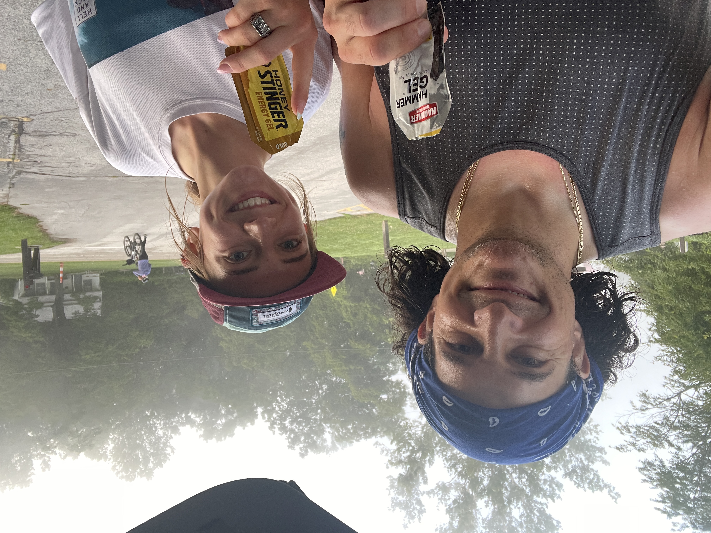

# About Me
My name is Megan Diulus, I'm a junior course 6-3 and on the varsity cross country and track teams! I also love art, specifically colored pencil drawing! I have three dogs at home: a bernese mountain dog, a rottweiler, and a bullmastiff!

# Table of Contents
[Link to Assignment 1](assignments/assignment1.md)

